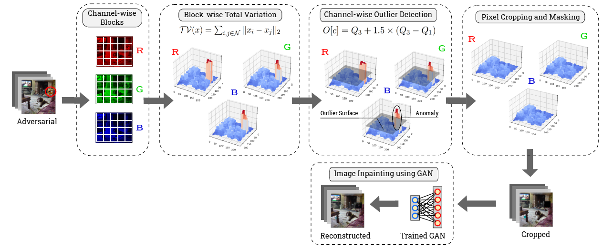
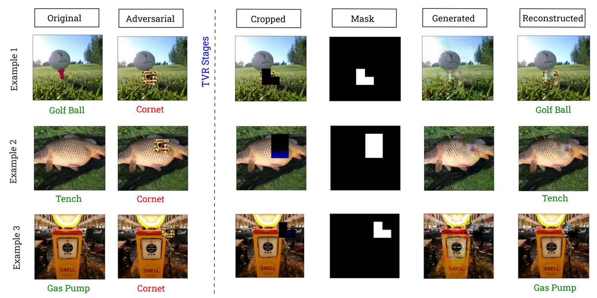

# Total Variation based image Resurfacing (TVR)

By [Abhijith Sharma](https://www.linkedin.com/in/abhijith-sharma/), [Phil Munz](https://www.linkedin.com/in/philmunz/), [Apurva Narayan](https://scholar.google.com/citations?user=e5OCZ1cAAAAJ&hl=en&authuser=2)

## Framework
Code for "[Assist Is Just as Important as the Goal: Image Resurfacing to Aid Model’s Robust Prediction]()" submitted in WACV 2024. 

 

**Takeaways**: 
1. Adversarial patches threaten visual AI models in the real world.
2. Number of patches in an attack is variable and determines its potency in a specific environment.
3. Existing defenses assume a single patch in the scene, and the multi-patch scenario is shown to overcome them.
4. The TVR is a model-agnostic defense against single and multi-patch attacks.
5. The TVR is an image-cleansing method that processes images to remove probable adversarial regions.
6. Nullifies the influence of patches in a single image scan with no prior assumption on the number of patches. 

### :chart_with_upwards_trend: Demo

 

## :page_with_curl: Requirements

Experiments were done with PyTorch 1.7.0 and timm 0.4.12. The complete list of required packages are available in `requirement.txt`, and can be installed with `pip install -r requirement.txt`. The code should be compatible with newer versions of packages. Update 04/2023: tested with `torch==1.13.1` and `timm=0.6.13`; the code should work fine.

## :open_file_folder: Files

```shell
├── README.md                        #this file 
├── requirement.text                 #required package
|
├── helper.py                        #helper functions to test and save results
├── image_resurfacer.py              #defense algorithm for image processing
├── main.py                          #main function to run the defense
|
├── Figures                          #figures of the framework 
├── GAN_Model                        #trained GAN model(.pt) for image inpainting
├── GAN_Train                        #scripts to train GAN model
|   ├── mask_data                    #masked data created using `mask_datagen.py'
|   ├── real_data                    #original data
|   ├── GAN.py                       #GAN architecture
|   ├── inpaint.py                   #GAN training
|   └── mask_datagen.py              #data generation for GAN training                        
| 
├── assets                           #assets related to data and benchmark adversarial patches
|   ├── data                         #utils for constructing models and data loaders
|   ├── val                          #utils for PatchCleanser defenses
|   └── imagenet_patch.gz            #ImageNet-Patch Benchmark patched
|
├── multi_patch                      #saved self-trained multiple adversarial patches 
|   ├── ResNet18                     
|   └── VGG16                        
|
├── results                          #results of the testings as .csv files
├── single_patch                     #saved self-trained single adversarial patches 
|   ├── ResNet18                     
|   └── VGG16                        
|
├── transforms                       #Imported from ImageNet-Patch Benchmark repo
|   ├── apply_patch.py               #functions for patch application over image
|   └── my_random_affine.py          #functions for patch's affine transformations
|
└── utils                            #Imported from ImageNet-Patch Benchmark repo
    ├── utils.py                     #utils for constructing models and data loaders
    └── visualization.py             #utils for visualization
```

## :open_book: Datasets

- [ImageNet](https://image-net.org/download.php) (ILSVRC2012)
- [ImageNette](https://github.com/fastai/imagenette) ([Full size](https://s3.amazonaws.com/fast-ai-imageclas/imagenette2.tgz))
- [ImageNet-Patch BenchMark Dataset](https://github.com/pralab/ImageNet-Patch)
    - (The benchmark adversarial patches are already imported so you do not have to do anything)

## :newspaper: Citations

If you find our work useful in your research, please consider citing:

```tex
@inproceedings{sharma2023vulnerability,
  title={Vulnerability of CNNs against Multi-Patch Attacks},
  author={Sharma, Abhijith and Bian, Yijun and Nanda, Vatsal and Munz, Phil and Narayan, Apurva},
  booktitle={Proceedings of the 2023 ACM Workshop on Secure and Trustworthy Cyber-Physical Systems},
  pages={23--32},
  year={2023}
}
```
